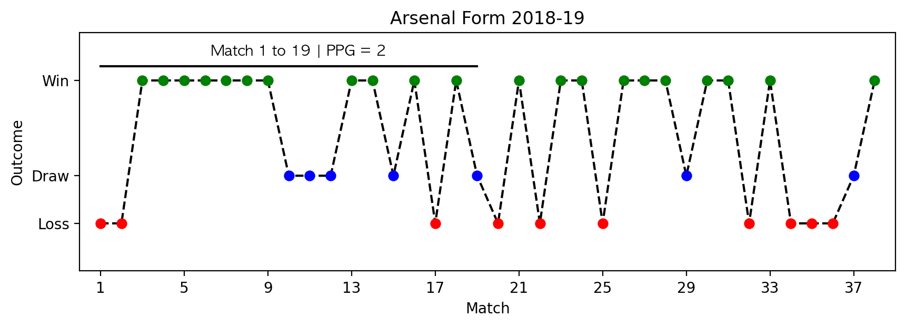
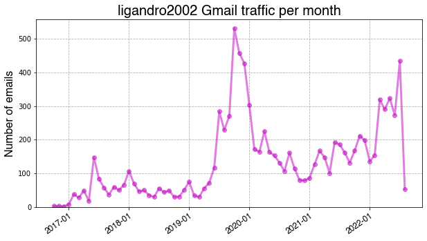
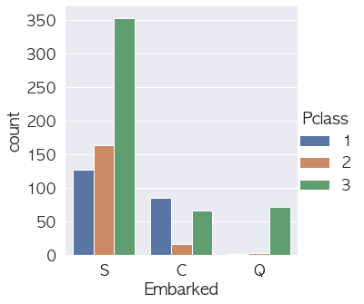
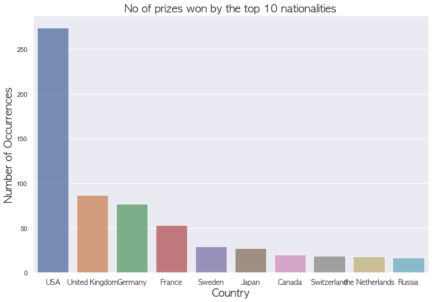
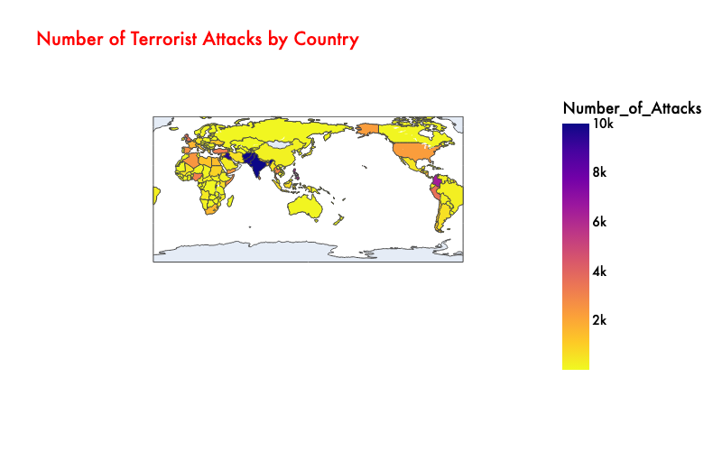

# Projects
# Collection of my data analysis projects
### Python,Matplotlib,Seaborn and Plotly are used in these projects

## Contents

  
Table of Contents

  <ol>
    <li><a href="#introduction"> ➤ Introduction</a></li>
    <li><a href="#folder-structure"> ➤ Folder Structure</a></li>
    <li><a href="#workflow"> ➤ Workflow</a></li>
    <li>
      <a href="#projects"> ➤ Projects</a>
      <ul>
        <li><a href="#pR1---arsenal-top-4-requirements">PR1 - Arsenal Top 4 Requirements</a></li>
        <li><a href="#13---xG-vS-g">13-xG VS G</a></li>
        <li><a href="#18---touch-locations">18- Touch Locations</a></li>
        <li><a href="#22---goals-timeline">22-Goals Timeline</a></li>
        <li><a href="#23---long-goalkicks">23- % Long Goalkicks</a></li>
        <li><a href="#33---oVA">33-OVA</a></li>
        <li><a href="#34---xT">34-xT 2</a></li>
        <li><a href="#42---sOT">42-SOT</a></li>
        <li><a href="#53---gD-time">53-GD Time</a></li>
      </ul>
    </li>
  </ol>

## Projects

### PR1 - Arsenal Top 4 Requirements

**Summary**: Use Fbref data to find out the minimum no of points required by Arsenal to finish in the top 4 using previous seasons data. Show Arsenal's form line graph and get insight into data.

   &nbsp &nbsp

### PR2- Personal Gmail Data Traffic Visualization
**Summary:** Get Personal Gmail data from google and plot date and time graphs of emai traffic.

   &nbsp &nbsp

### PR3 - Titanic data exploratory analysis and data visualization

**Summary:** Exploratory Data Analysis of Titanic Data

   &nbsp &nbsp

### PR5- Nobel Prize Dataset Visualization

**Summary:** Visualize nobel prize winners dataset.

   &nbsp &nbsp 

### PR7- Terrorism Dataset Visualization

**Summary:** Visualising terrorism dataset and getting insight on terrorism trends.

   &nbsp &nbsp 

**Summary:** Compare Shots on Target taken and conceded by teams in the Premier League using scatter plot.Good teams take SOT Taken and concede less SOT 

   &nbsp &nbsp 

### 53 - GD Time
